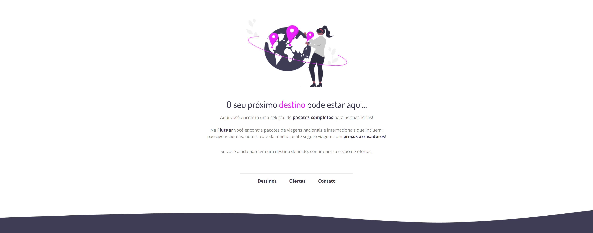

# Flutuar

**Desafio intermediário - Recriando layout**
(_Vide link do projeto em About)_
**Trilha Explorer - Rocketseat** 🚀 💜

## 🔰 Tecnologias

HTML
CSS
Git e Github

## 📚 Aprendizados
Nesse projeto aprendi como usar o + em _a href_ e posicionar uma imagem utilizando o _position: absolute_ e também como inserir o _favicon_ no HTML. 

Os meus maiores desafios foram: como posicionar a imagem da onda sem utilizar nenhum display e vincular o _favicon_ no HTML.

Superei minhas dificuldades lendo mais atentamente a documentação do desafio e desta forma segui as instruções para aplicar o _favicon_ no projeto.

Sobre o posicionamento da imagem tive colaboração de amigos queridos do Explorer através do _Open Coding_.
## 👩🏽‍💻 Autora e 👨🏻‍💻 colaboradores

- [Grace Kelly](https://github.com/gksouza)
- [Eduardo Gomes](https://github.com/EduardoNGomes)
- [Gabriel Santos](https://github.com/gabrielSantos1101)

## 🤸‍♀️ Contato
https://www.linkedin.com/in/gkos22/

e-mail: gkoliver2020@gmail.com